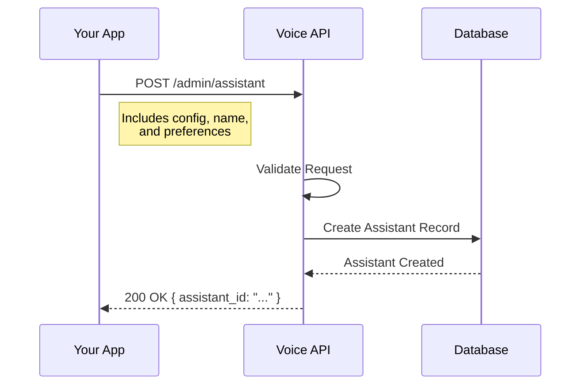

import { Tabs, TabItem } from '@astrojs/starlight/components';

The `Create Assistant` endpoint allows you to programmatically create a new voice assistant. You can configure its personality, voice, tools, and other settings.

## Endpoint

<div style="background-color: #e6f4ea; color: #1e7e34; padding: 10px; border-radius: 4px; font-family: monospace; font-weight: bold; display: inline-block; margin-bottom: 20px;">
POST /admin/assistant
</div>

## Request Flow



## Request Parameters

### Headers

| Header | Type | Required | Description |
| :--- | :--- | :--- | :--- |
| `workspace` | string | **Yes** | Your unique workspace ID. |
| `organization` | string | **Yes** | Your organization ID. |
| `Authorization` | string | **Yes** | Bearer token for authentication. |
| `Content-Type` | string | **Yes** | Must be `application/json`. |

### Body Parameters

| Parameter | Type | Required | Description |
| :--- | :--- | :--- | :--- |
| `name` | string | **Yes** | Name of the assistant. |
| `config` | object | **Yes** | Configuration object for the assistant. |

### Config Object

| Parameter | Type | Required | Description |
| :--- | :--- | :--- | :--- |
| `system_prompt` | string | **Yes** | The persona and instructions for the assistant. |
| `end_message` | string | No | Message to speak when ending the call. |
| `tool_config` | array | No | List of tools enabled for the assistant. |
| `model` | object | **Yes** | LLM configuration (provider, model). |
| `transcriber` | object | **Yes** | Transcriber configuration (provider, model). |
| `voice` | object | **Yes** | Voice configuration (provider, voiceId, model). |
| `structured_data` | array | No | Schema for structured data extraction. |

## Code Examples

<Tabs>
  <TabItem label="cURL" icon="linux">
    ```bash
    curl --location 'https://api.voice-agents.miraiminds.co/v1/admin/assistant' \
    --header 'workspace: 68a4410242a5c31c24ed063b' \
    --header 'organization: 68a44064be1aab154e4806ee' \
    --header 'Content-Type: application/json' \
    --header 'Authorization: Bearer <YOUR_TOKEN>' \
    --data '{
        "name": "test assistant",
        "config": {
            "system_prompt": "You are a helpful assistant.",
            "end_message": "Goodbye!",
            "tool_config": [],
            "model": {
                "provider": "openai",
                "model": "gpt-4o-mini"
            },
            "transcriber": {
                "provider": "deepgram",
                "model": "nova-3"
            },
            "voice": {
                "provider": "cartesia",
                "voiceId": "791d5162-d5eb-40f0-8189-f19db44611d8",
                "model": "sonic-2"
            },
            "structured_data": []
        }
    }'
    ```
  </TabItem>
  <TabItem label="Node.js" icon="node">
    ```javascript
    const myHeaders = new Headers();
    myHeaders.append("workspace", "68a4410242a5c31c24ed063b");
    myHeaders.append("organization", "68a44064be1aab154e4806ee");
    myHeaders.append("Content-Type", "application/json");
    myHeaders.append("Authorization", "Bearer <YOUR_TOKEN>");

    const raw = JSON.stringify({
      "name": "test assistant",
      "config": {
        "system_prompt": "You are a helpful assistant.",
        "end_message": "Goodbye!",
        "tool_config": [],
        "model": {
          "provider": "openai",
          "model": "gpt-4o-mini"
        },
        "transcriber": {
          "provider": "deepgram",
          "model": "nova-3"
        },
        "voice": {
          "provider": "cartesia",
          "voiceId": "791d5162-d5eb-40f0-8189-f19db44611d8",
          "model": "sonic-2"
        },
        "structured_data": []
      }
    });

    const requestOptions = {
      method: "POST",
      headers: myHeaders,
      body: raw,
      redirect: "follow"
    };

    fetch("https://api.voice-agents.miraiminds.co/v1/admin/assistant", requestOptions)
      .then((response) => response.json())
      .then((result) => console.log(result))
      .catch((error) => console.error(error));
    ```
  </TabItem>
  <TabItem label="Python" icon="python">
    ```python
    import requests
    import json

    url = "https://api.voice-agents.miraiminds.co/v1/admin/assistant"

    payload = json.dumps({
      "name": "test assistant",
      "config": {
        "system_prompt": "You are a helpful assistant.",
        "end_message": "Goodbye!",
        "tool_config": [],
        "model": {
          "provider": "openai",
          "model": "gpt-4o-mini"
        },
        "transcriber": {
          "provider": "deepgram",
          "model": "nova-3"
        },
        "voice": {
          "provider": "cartesia",
          "voiceId": "791d5162-d5eb-40f0-8189-f19db44611d8",
          "model": "sonic-2"
        },
        "structured_data": []
      }
    })
    headers = {
      'workspace': '68a4410242a5c31c24ed063b',
      'organization': '68a44064be1aab154e4806ee',
      'Content-Type': 'application/json',
      'Authorization': 'Bearer <YOUR_TOKEN>'
    }

    response = requests.request("POST", url, headers=headers, data=payload)

    print(response.text)
    ```
  </TabItem>
</Tabs>

## Response

Returns a JSON object containing the created assistant details.

### Success Response (`200 OK`)

```json
{
  "success": true,
  "message": "Assistant created successfully",
  "data": {
    "_id": "6927ec5c9322ed9f9fb55c68",
    "name": "test assistant",
    "config": { ... },
    "createdAt": "2025-11-27T10:00:00.000Z"
  }
}
```
