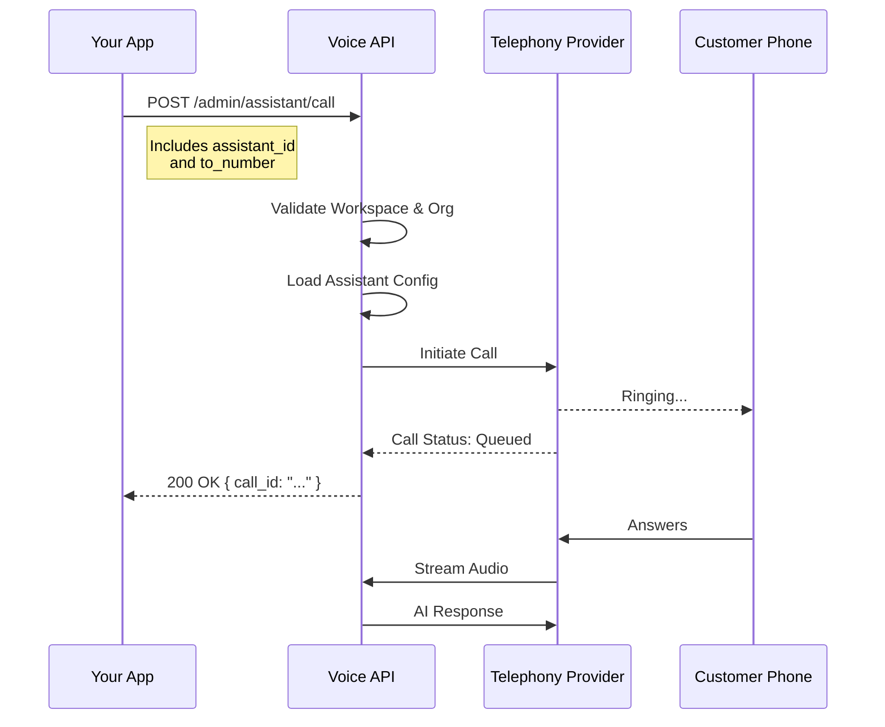

import { Tabs, TabItem } from '@astrojs/starlight/components';

The `Make a Call` endpoint allows you to programmatically trigger an outbound call to any phone number using a specific voice assistant. This is useful for automated notifications, appointment reminders, or immediate lead qualification.

## Endpoint

<div style="background-color: #e6f4ea; color: #1e7e34; padding: 10px; border-radius: 4px; font-family: monospace; font-weight: bold; display: inline-block; margin-bottom: 20px;">
POST /admin/assistant/call
</div>

## Request Flow

Before the call is placed, the system validates your workspace, checks the assistant's availability, and then initiates the telephony connection.



## Request Parameters

### Headers

| Header | Type | Required | Description |
| :--- | :--- | :--- | :--- |
| `workspace` | string | **Yes** | Your unique workspace ID. |
| `organization` | string | **Yes** | Your organization ID. |
| `Content-Type` | string | **Yes** | Must be `application/json`. |
| `Authorization` | string | **Yes** | Bearer token for authentication. |

### Body Parameters

| Parameter | Type | Required | Description |
| :--- | :--- | :--- | :--- |
| `assistant_id` | string | **Yes** | The unique identifier of the assistant to place the call. |
| `to_number` | string | **Yes** | The phone number to call in E.164 format (e.g., `+919723067241`). |

## Code Examples

<Tabs>
  <TabItem label="cURL" icon="linux">
    ```bash
    curl --location 'https://api.voice-agents.miraiminds.co/v1/admin/assistant/call' \
    --header 'workspace: 68d63c242cd956c2bb41cd3a' \
    --header 'organization: 68d63c242cd956c2bb41cd12' \
    --header 'Content-Type: application/json' \
    --header 'Authorization: Bearer <YOUR_TOKEN>' \
    --data '{
        "assistant_id": "68c128a658cd7d0668bce78d",
        "to_number": "+919723067241"
    }'
    ```
  </TabItem>
  <TabItem label="Node.js" icon="node">
    ```javascript
    const myHeaders = new Headers();
    myHeaders.append("workspace", "68d63c242cd956c2bb41cd3a");
    myHeaders.append("organization", "68d63c242cd956c2bb41cd12");
    myHeaders.append("Content-Type", "application/json");
    myHeaders.append("Authorization", "Bearer <YOUR_TOKEN>");

    const raw = JSON.stringify({
      "assistant_id": "68c128a658cd7d0668bce78d",
      "to_number": "+919723067241"
    });

    const requestOptions = {
      method: "POST",
      headers: myHeaders,
      body: raw,
      redirect: "follow"
    };

    fetch("https://api.voice-agents.miraiminds.co/v1/admin/assistant/call", requestOptions)
      .then((response) => response.json())
      .then((result) => console.log(result))
      .catch((error) => console.error(error));
    ```
  </TabItem>
  <TabItem label="Python" icon="python">
    ```python
    import requests
    import json

    url = "https://api.voice-agents.miraiminds.co/v1/admin/assistant/call"

    payload = json.dumps({
      "assistant_id": "68c128a658cd7d0668bce78d",
      "to_number": "+919723067241"
    })
    headers = {
      'workspace': '68d63c242cd956c2bb41cd3a',
      'organization': '68d63c242cd956c2bb41cd12',
      'Content-Type': 'application/json',
      'Authorization': 'Bearer <YOUR_TOKEN>'
    }

    response = requests.request("POST", url, headers=headers, data=payload)

    print(response.text)
    ```
  </TabItem>
</Tabs>

## Response

Returns a JSON object containing the status of the call request.

### Success Response (`200 OK`)

```json
{
  "success": true,
  "message": "Call initiated successfully",
  "data": {
    "call_id": "c_1234567890",
    "status": "queued",
    "assistant_id": "68c128a658cd7d0668bce78d",
    "to_number": "+919723067241"
  }
}
```

### Common Errors

- `400 Bad Request`: Missing `to_number` or invalid `assistant_id`.
- `401 Unauthorized`: Invalid or missing `workspace`/`organization`/`Authorization` headers.
- `404 Not Found`: Assistant ID does not exist in the specified workspace.
