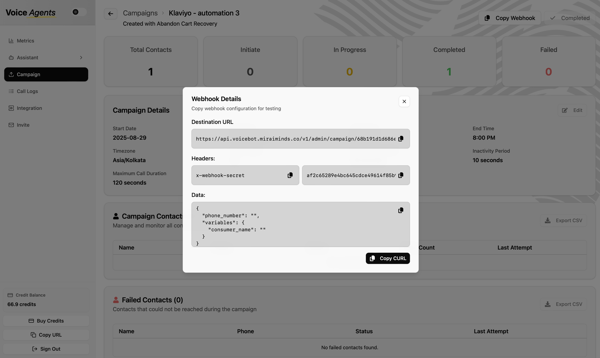

import { Card, CardGrid } from "@astrojs/starlight/components";
import CallToActionBanner from "../../../components/CallToActionBanner.astro";

## Overview

Abandon cart recovery is one of the most powerful applications of Voice Agents in e-commerce, capable of recovering up to 20% of abandoned carts through intelligent, automated outreach. This guide provides complete setup instructions for implementing abandon cart recovery using GoKwik webhook integration and [Shopify coupon automation](/integration/shopify/).

<CardGrid>
    <Card title="Quick Setup" icon="stopwatch">
        **Estimated Time:** ~30 minutes <br/>
        **Core Requirements:** GoKwik, [Shopify](/integration/shopify/), and [WhatsApp](/integration/whatsapp/) integrations.
    </Card>
    <Card title="Automated & Instant" icon="rocket">
        Instantly detect abandoned carts via GoKwik webhooks and trigger a personalized AI voice call within minutes.
    </Card>
    <Card title="Smart Incentives" icon="star">
        Automatically generate unique, time-sensitive Shopify discount coupons to encourage purchase completion.
    </Card>
    <Card title="Multi-Channel Outreach" icon="phone">
        Combine an AI voice call with an immediate WhatsApp follow-up containing the checkout link and coupon code.
    </Card>
</CardGrid>

## How It Works

The recovery system operates through a seamless, automated workflow triggered in real-time:

1.  **Cart Abandoned:** A customer abandons their cart on your GoKwik checkout page.
2.  **Webhook Trigger:** GoKwik instantly sends a webhook notification to the Voice Agents platform with the cart and customer details.
3.  **Coupon Generated:** The system connects to your [Shopify store](/integration/shopify/) and automatically generates a unique, time-limited discount coupon.
4.  **AI Voice Call:** Within minutes, an AI Voice Agent places a personalized call to the customer, referencing their cart items and offering the discount.
5.  **WhatsApp Follow-up:** Immediately after the call, a [WhatsApp message](/integration/whatsapp/) is sent containing the direct GoKwik checkout link and the unique coupon code, making it easy to complete the purchase.

## Data Access & Permissions

We prioritize your data security and privacy. Our system is designed to be non-intrusive and only accesses the minimal data required to function.

:::note[Strictly Read-Only and Action-Specific]
The Voice Agents system **NEVER** manipulates cart contents, modifies payment information, or alters customer data in GoKwik or Shopify. It only listens for events and performs specific, authorized actions.
:::

-   **GoKwik Integration:**
    -   **Access:** Listens to the Abandon Cart webhook to receive customer contact info, cart contents, and the cart recovery link.
    -   **Permissions:** Read-only.

-   **[Shopify Integration](/integration/shopify/):**
    -   **Access:** Reads product information (like titles) using the product ID provided by GoKwik.
    -   **Permissions:** Primarily requires permission to **create and manage discount codes**.

-   **[WhatsApp Integration](/integration/whatsapp/):**
    -   **Access:** No access to your WhatsApp data.
    -   **Permissions:** Requires permission to **send messages** using your pre-approved templates.

## Setup Guide

Follow these steps to configure your automated abandon cart recovery campaign.

### Step 1: GoKwik Webhook Integration

This is the recommended method for real-time recovery.

1.  **Contact the GoKwik Integration Team.**
    -   Email: `integration@gokwik.co`
    -   Subject: `Voice Agents Abandon Cart Webhook Setup`
    -   Body: "Hello, please add the abandon cart webhook integration for our account to send notifications to the Voice Agents platform. Our webhook endpoint is: `[Your Webhook URL]`"

2.  **Get Your Webhook Endpoint.**
    -   You can find this unique URL in your abandon cart campaign page on the Voice Agents platform.
   


3.  **How It Works:** 
    -   Once configured, GoKwik will send a JSON payload with cart details to this endpoint whenever a cart is abandoned. Our platform automatically extracts the relevant information (customer name, phone, cart items) to initiate the recovery call.

#### GoKwik Webhook Data Structure
```json
{
  "cartId": "688bb9076b9a7a596ca17c30",
  "timeInitiated": "Aug 01, 2025 12:12 AM",
  "custPhone": "8851655953",
  "custName": "sachin behl",
  "custEmail": "maverick0783@gmail.com",
  "line_items": [
    {
      "productName": "Travel Fresh Pro (Pack of 3) - Pack of 3",
      "productQuantity": 1,
      "productVariant": "46338199126323",
      "productPrice": 1499.0
    }
  ],
  "cartTotal": 1499.0,
  "subtotal": 1499.0,
  "shippingCharges": 0.0,
  "codCharges": 0.0,
  "prepaidDiscount": 0.0,
  "couponDiscount": 0.0,
  "checkoutStage": "ORDER_SCREEN",
  "communicationSent": 0,
  "NoOfSMSSent": 0,
  "NoOfWhatsappSent": 0,
  "communicationTime": "",
  "channel": "SHOPIFY",
  "abandonLink": "https://urturms.com/?cart-resume-id=688bb9076b9a7a596ca17c30&type=report,fastrr,",
  "source": "fastrr",
  "address": "a 304 garden estate apartment, sector 22 plot 5b dwarka,arka,south west delhi,dl, New delhi, Delhi, 110077",
  "recoverStatus": "NOT_RECOVERED",
  "recoverFastrrOrderId": "",
  "recoverPlatformOrderId": "",
  "recoverClientOrderId": "",
  "recoverOrderCreatedAt": ""
}
```

### Step 2: Shopify Integration Setup

This is required for automatically generating discount codes. For detailed setup instructions, see our [complete Shopify integration guide](/integration/shopify/).

1.  **Connect Your Store:** In the Voice Agents dashboard, navigate to `Integrations` and select `Shopify`.
2.  **Authorize:** Enter your Shopify store URL (`your-store.myshopify.com`) and follow the prompts to authorize the connection.
3.  **Configure Coupon Settings:**
    -   **Discount Percentage:** Set a default value (e.g., 10%).
    -   **Coupon Validity:** Set an expiration time (e.g., 1 hour) to create urgency.
    -   **Usage Limits:** Configure as single-use per customer.

### Step 3: WhatsApp Integration Setup

This is required for sending the follow-up message with the checkout link.

1.  **Connect Your Account:** In the Voice Agents dashboard, navigate to `Integrations` and select `WhatsApp`.
2.  **Authorize:** Follow the steps to connect your WhatsApp Business Account (WABA).
3.  **Configure Message Template:**
    -   Select or create an approved message template for abandon cart recovery.
    -   Ensure it includes placeholders for the customer's name, coupon code, and the GoKwik checkout link.

### Step 4: Tracking Recovery Success

To measure the effectiveness of your campaigns, we automatically add UTM parameters to the checkout link.

-   **UTM Parameters:** The `abandonLink` from GoKwik is appended with parameters like `&utm_source=voiceagents&utm_medium=call`.
-   **Attribution:** This allows you to see all recovered orders attributed directly to Voice Agents on your GoKwik dashboard, giving you a clear view of your ROI.

## Alternative Method: CSV Upload

:::caution[Not Recommended]
Using the CSV method significantly delays outreach, reducing the "heat of the moment" urgency and lowering conversion rates. Only use this if real-time webhook integration is not possible.
:::

1.  **Export Data:** Export your abandoned cart data from the GoKwik dashboard.
2.  **Format CSV:** Ensure the file includes columns for customer phone, name, cart items, and the checkout URL.
3.  **Upload Manually:** Upload the formatted CSV to a new campaign on the Voice Agents platform.

## Best Practices for Optimization

-   **Timing is Key:** The AI call should be triggered within 5-15 minutes of abandonment for the highest impact.
-   **Smart Discounts:** Start with a 5-10% discount. A/B test different offers to find what works best for your audience.
-   **Clear Call to Action:** Both the voice call and WhatsApp message should clearly guide the user to complete their purchase using the provided link and code.
-   **Monitor & Refine:** Regularly check your campaign's performance metrics (recovery rate, coupon redemption rate) and refine your call scripts and offers accordingly.

<CallToActionBanner
  title="Ready to recover your abandoned carts?"
  subtitle="Start converting lost sales into revenue with intelligent abandon cart recovery."
  buttonText="Schedule Integration Setup"
  buttonColor="#039BE5"
/>
