import { Card, CardGrid } from "@astrojs/starlight/components";
import CallToActionBanner from "../../../components/CallToActionBanner.astro";

## Overview

Voice campaigns allow you to automate outbound calls to multiple contacts. You can create campaigns using CSV data uploads or connect directly through your existing systems via API integration.

<CardGrid stagger>
  <Card title="CSV Data Upload" icon="document">
    Upload contact lists using our CSV template for quick campaign setup and
    data management.
  </Card>
  <Card title="API Integration" icon="puzzle">
    Connect your existing systems via webhook to automatically sync contact
    data.
  </Card>
  <Card title="Smart Scheduling" icon="calendar">
    Configure precise timing, timezone handling, and operating hours for optimal
    contact rates.
  </Card>
  <Card title="Call Management" icon="phone">
    Set retry logic, call duration limits, and inactivity periods to maximize
    efficiency.
  </Card>
</CardGrid>

## Setup Guide

### Step 1: Access Campaign Creation

1. **Navigate to Campaigns Page**

   Go to the **Campaigns** section in your Voice Agents dashboard.

   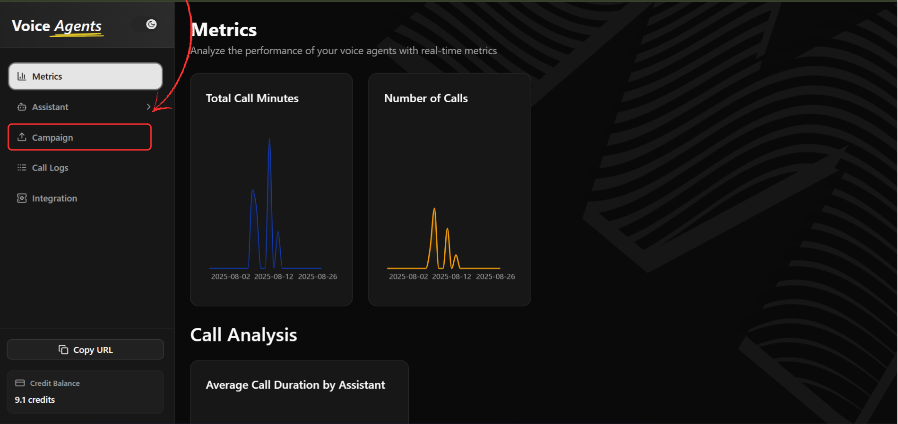

2. **Create New Campaign**

   Click the **"Create Campaign"** button to start the setup process.

   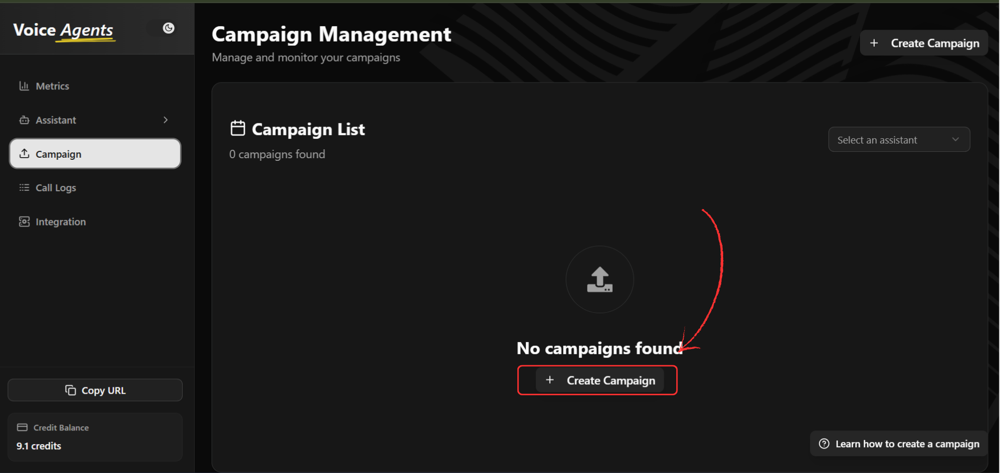

### Step 2: Basic Campaign Configuration

3. **Enter Campaign Name**

   Provide a descriptive name for your campaign that clearly identifies its purpose.

   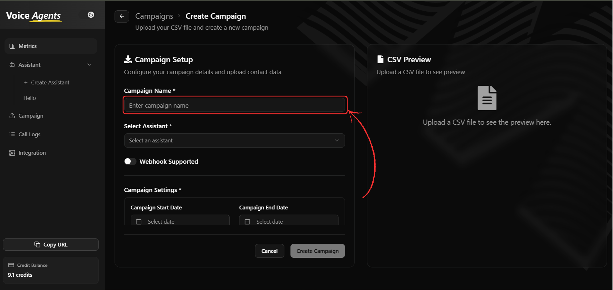

4. **Select Voice Assistant**

   Choose the voice assistant that will handle all calls for this campaign.

   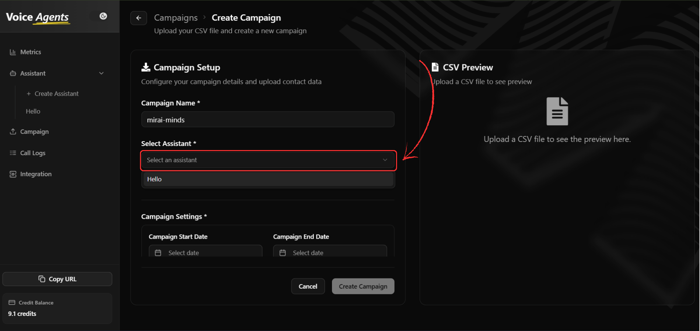

5. **Configure Webhook Integration**

   Enable webhook integration if you need to add data from your platform through API. When enabled, CSV upload becomes optional.

   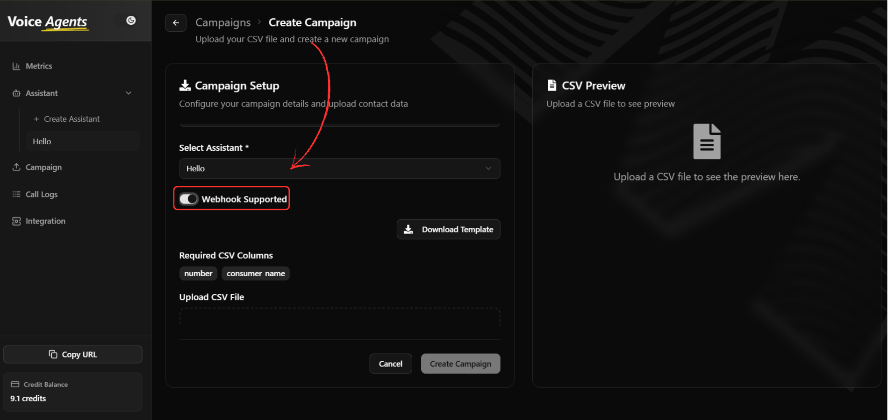

### Step 3: Data Management Setup

#### Option A: CSV Data Upload

6. **Download CSV Template**

   Click **"Download CSV Template"** to get the correct format for your contact data.

   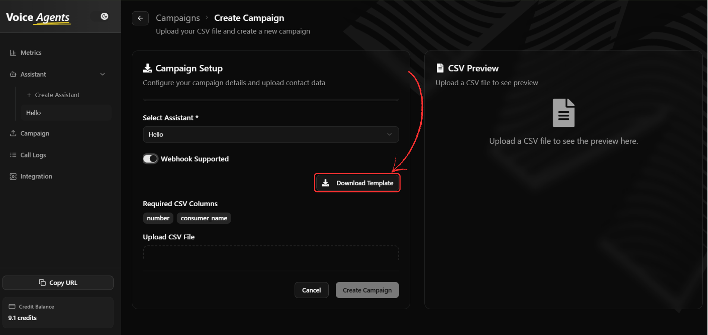

7. **Prepare Your Contact Data**

   Update the downloaded CSV template with your contact information, ensuring all required fields are completed.

8. **Upload CSV File**

   Upload your completed CSV file using the file upload interface.

   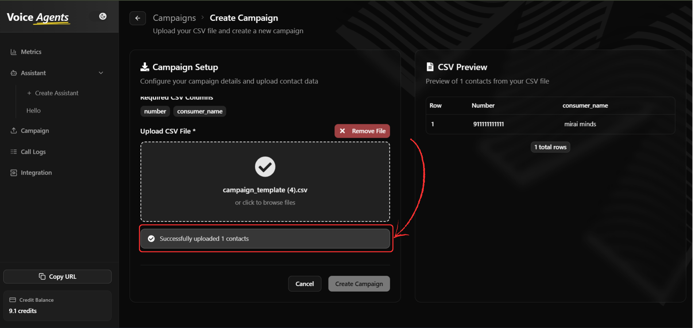

9. **Preview Contact Data**

   Review your uploaded data in the right panel preview to verify accuracy before proceeding.

   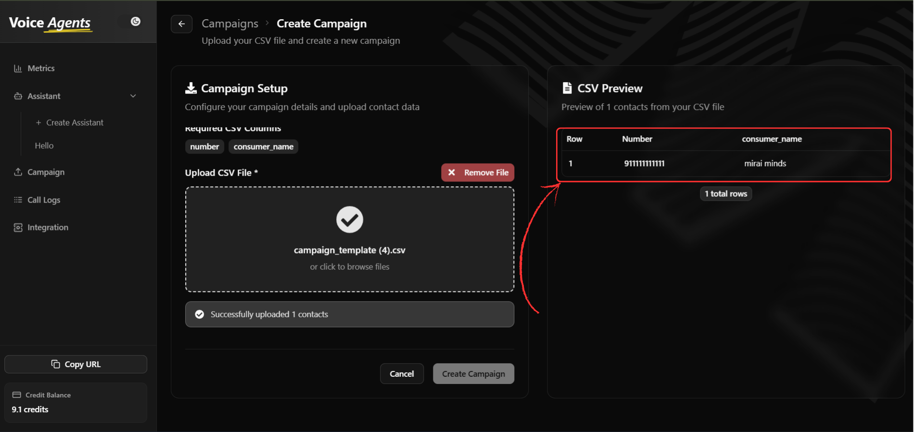

#### Option B: API Integration

When webhook is enabled, your platform can send contact data directly through API calls, eliminating the need for manual CSV uploads.

### Step 4: Schedule Configuration

10. **Set Campaign Dates**

    Configure your campaign timeline:

    - **Start Date**: Select when the campaign should begin
    - **End Date**: Choose when the campaign should conclude

    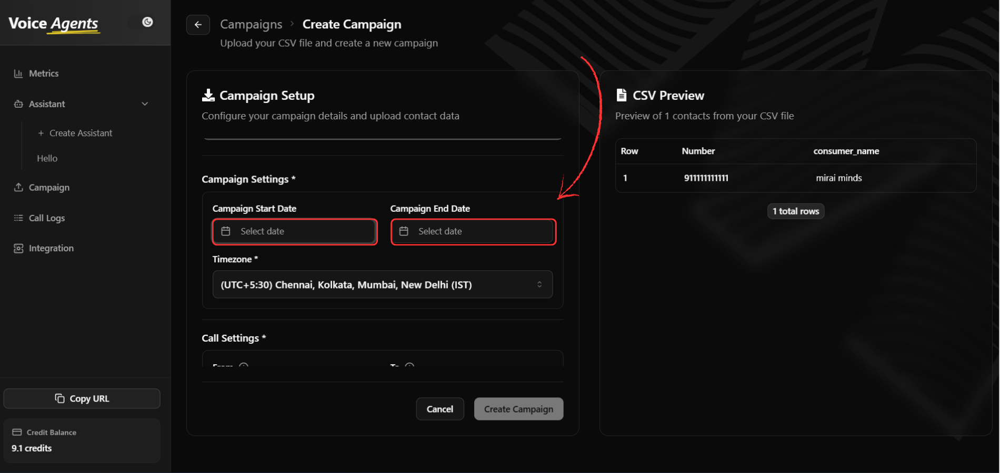

11. **Configure Timezone**

    Select the appropriate timezone for your campaign to ensure calls are made at the right local times.

    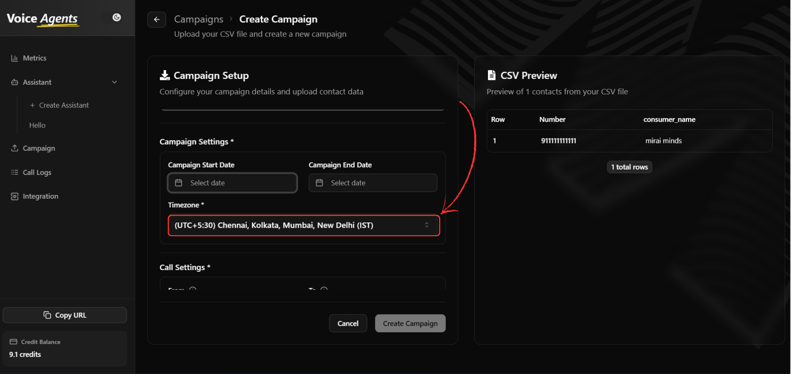

12. **Set Operating Hours**

    Define your campaign's daily calling window:

    - **Start Time**: When calls can begin each day
    - **End Time**: When calls should stop each day

    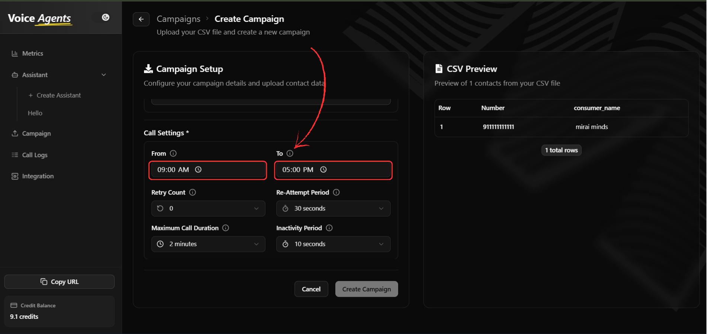

### Step 5: Call Behavior Settings

13. **Configure Retry Logic**

    Set how the system handles unsuccessful call attempts:

    - **Retry Count**: Number of attempts to reach each contact
    - **Re-Attempt Period**: Time interval between retry attempts

    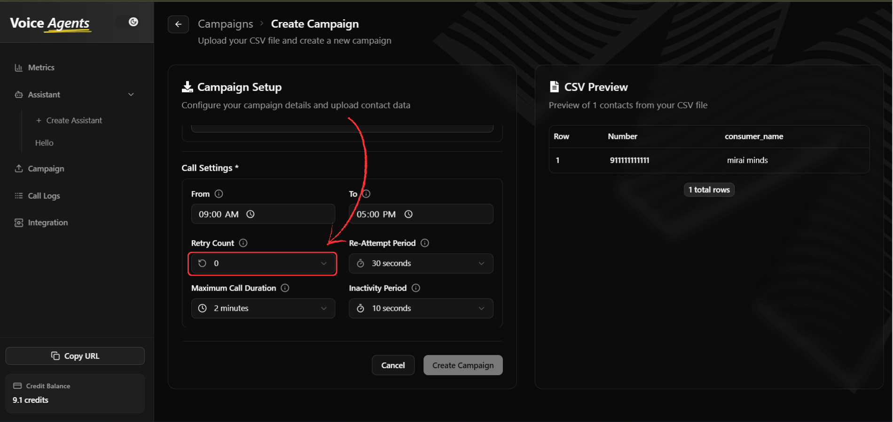
    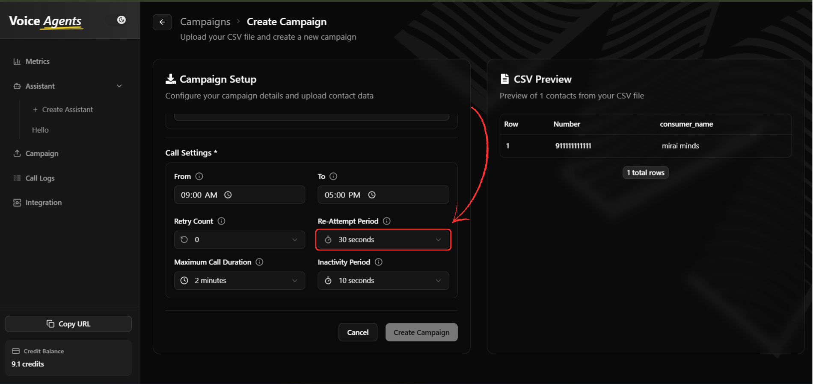

14. **Set Call Duration Limits**

    Configure call timing parameters:

    - **Maximum Call Duration**: Longest allowable call time
    - **Inactivity Period**: Wait time during no response before ending calls

    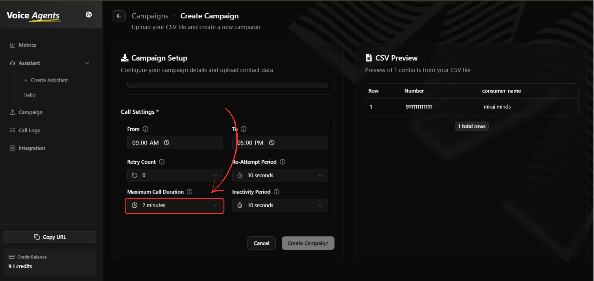
    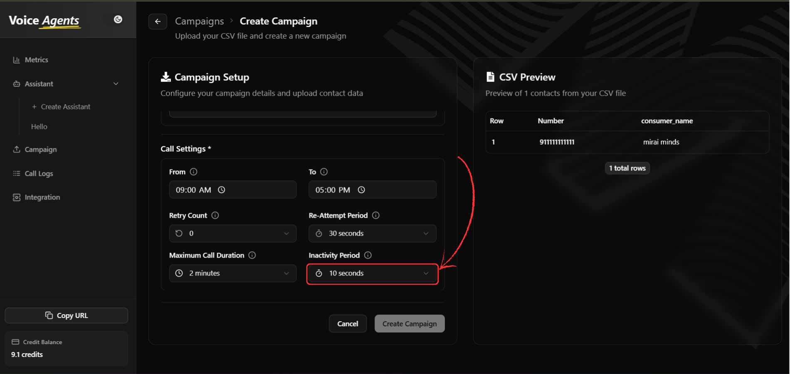

### Step 6: Launch Campaign

15. **Create**

    Once all settings are configured, click **"Create Campaign"** to Create your campaign.

    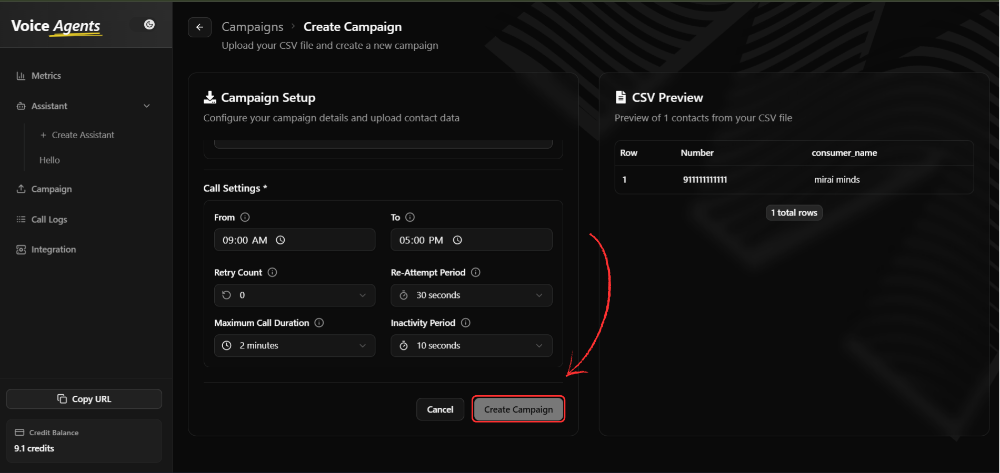

16. **Handle Data Validation**

    After clicking create, the system processes your data:

    - **Valid Data**: Successfully stored and included in the campaign
    - **Invalid/Missing Data**: Not stored but displayed in a validation modal

    Any invalid or missing entries will be shown in list format, allowing you to download this data for correction and potential re-upload.

### Step 7: Launch and Manage Campaign

17. **Launch Your Campaign**

    After creating your campaign, navigate to the campaign list to launch it. Click the **"Play"** button next to your campaign to start making calls.

    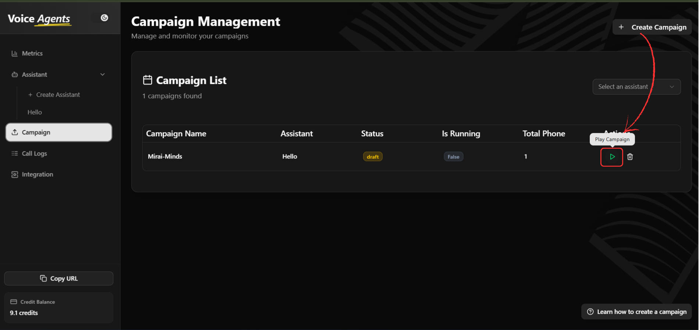

18. **Track Campaign Status**

    Monitor your campaign's progress by visiting the **Campaign Status** page. Here you can view:

    - Call completion rates
    - Success/failure statistics
    - Real-time campaign progress
    - Contact attempt history

    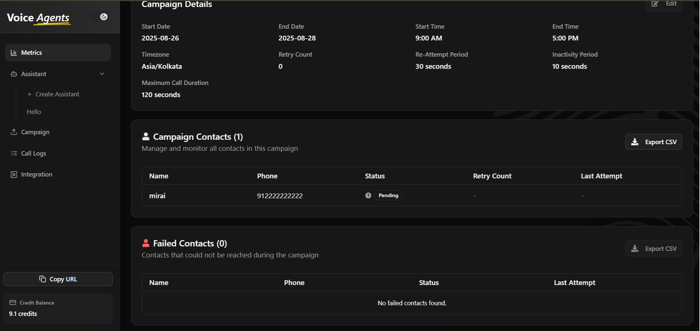

19. **Copy Webhook API Endpoint**

    If you enabled webhook integration, you can copy the API endpoint for your platform integration. Click **"Copy Webhook"** to get the endpoint URL for sending data via API.

    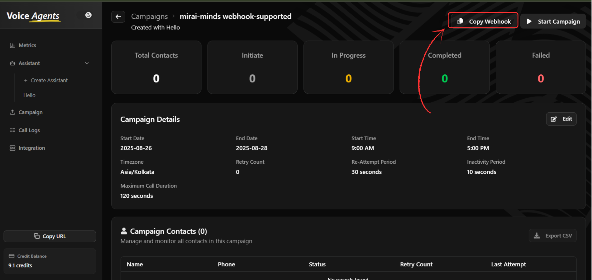

    Use this endpoint to programmatically add contacts to your campaign or trigger campaign events from your existing systems.

## What's Next?

Once your campaign is created and launched, you can:

- **Monitor Performance** - Track call success rates and campaign progress
- **Manage Active Campaigns** - Pause, resume, or modify running campaigns
- **Analyze Results** - Review detailed campaign analytics and outcomes
- **Export Reports** - Download campaign performance data

## Best Practices

### Data Preparation

- Test your CSV data with a small sample before uploading large datasets
- Ensure phone numbers are properly formatted for your target regions
- Include all required fields to minimize data validation issues

### Campaign Optimization

- Set reasonable retry limits to avoid overwhelming contacts
- Configure appropriate operating hours to respect contact preferences
- Monitor initial performance and adjust settings as needed

### Compliance Considerations

- Ensure you have proper consent to contact all numbers in your campaign
- Respect do-not-call lists and opt-out requests
- Follow local regulations for automated calling

<CallToActionBanner
  title="Ready to launch your first voice campaign?"
  subtitle="Start automating your customer outreach with intelligent voice agents today."
  buttonText="Schedule a Demo"
  buttonColor="#039BE5"
/>
