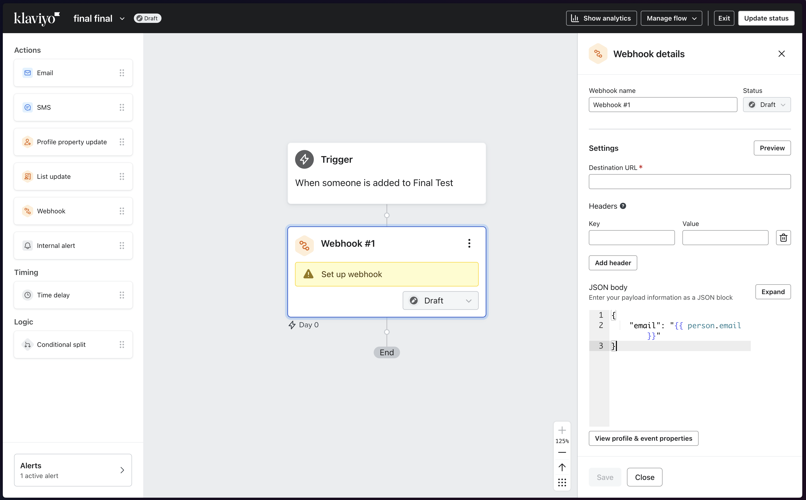
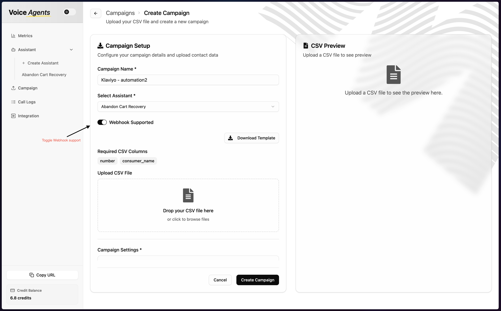
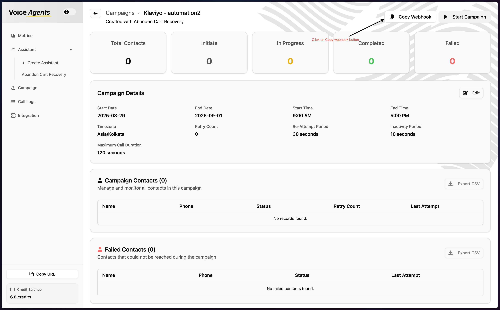
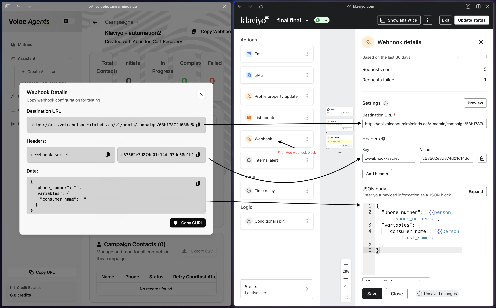

import { Card, CardGrid } from "@astrojs/starlight/components";
import CallToActionBanner from "../../../components/CallToActionBanner.astro";

## Overview

Integrating Voice Agent with Klaviyo enables your brand to add a powerful calling channel to your marketing campaigns. By connecting a Voice Agent webhook node in Klaviyo flows, you can reach customers with personalized voice calls, improving engagement and conversion rates. Voice Agents can deliver campaign messages, collect feedback, and assist customers directly, making your outreach more interactive and effective.

<CardGrid stagger>
    <Card title="Recover Abandoned Cart" icon="shopping-cart">
        Boost recovery rates by up to 30% with automated voice calls, outperforming traditional email or WhatsApp campaigns.
    </Card>
    <Card title="Replenishment Reminders" icon="repeat">
        Send timely voice reminders for replenishable products, ensuring customers never run out of essentials.
    </Card>
    <Card title="Actionable Feedback Collection" icon="comment">
        Engage customers with calls to gather solid, actionable feedback, improving your products and services.
    </Card>
    <Card title="Personalized Outreach" icon="user">
        Use customer data from Klaviyo to personalize voice interactions, increasing relevance and response rates.
    </Card>
</CardGrid>

## Setup Guide

### Step 1: Add Webhook Node in Klaviyo Flow

1. **Navigate to Your Klaviyo Flow**

   Open your existing Klaviyo flow or create a new one where you want to add voice agent integration.

2. **Add Webhook Node**

   Click the "+" button to add a new action and select "Webhook" from the available options.

   

### Step 2: Create Voice Agent Campaign with Webhook Support

3. **Access Voice Agents Dashboard**

   Navigate to the **Campaigns** section in your Voice Agents platform and create a new campaign.

4. **Enable Webhook Integration**

   When creating your campaign, make sure to enable webhook support. This allows Klaviyo to send contact data directly to your voice agent campaign.

   

   :::tip[Need more details?]
   For complete campaign setup instructions, see our [Campaign Management Guide](/guides/campaign/).
   :::

### Step 3: Copy Webhook Details

5. **Copy Webhook Endpoint**

   After creating your campaign with webhook support enabled, click the **"Copy Webhook"** button to reveal the webhook configuration modal.

   

   This will display:
   - **Webhook URL** - The endpoint where Klaviyo will send data
   - **Secret Key** - For secure authentication between platforms

### Step 4: Configure Klaviyo Webhook

6. **Setup Webhook in Klaviyo**

   Return to your Klaviyo flow and configure the webhook node with the details from your Voice Agent campaign:

   - Paste the **Webhook URL** in the endpoint field
   - Add the **Secret Key** for authentication
   - Configure any additional payload data you want to send

   

7. **Test and Activate**

   Test your webhook connection to ensure data flows correctly between Klaviyo and Voice Agents, then activate your flow.

## What's Next?

Once your integration is complete, your Klaviyo flows can automatically trigger voice agent calls for:

- **Abandoned Cart Recovery** - Reach customers who left items in their cart
- **Post-Purchase Follow-up** - Collect feedback and encourage repeat purchases
- **Replenishment Reminders** - Notify customers when it's time to reorder
- **Win-back Campaigns** - Re-engage inactive customers with personalized calls

The voice agent will receive customer data from Klaviyo and can personalize conversations based on purchase history, preferences, and behavior patterns.

<CallToActionBanner
  title="Ready to boost your Klaviyo campaigns with voice?"
  subtitle="Transform your email and SMS flows into engaging voice conversations."
  buttonText="Schedule a Demo"
  buttonColor="#039BE5"
/>
