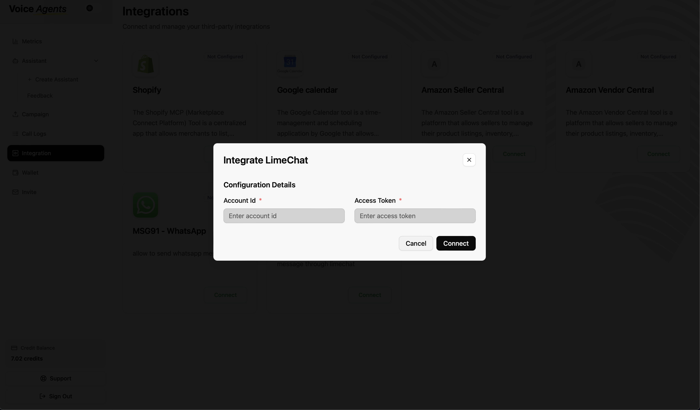
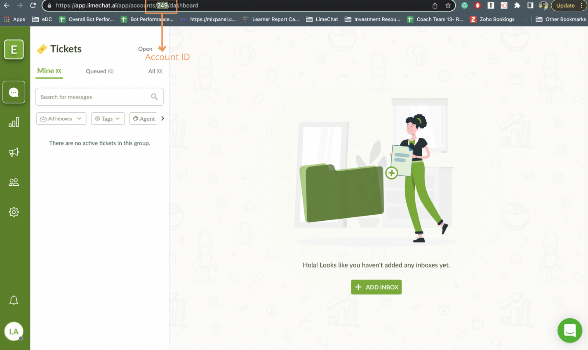
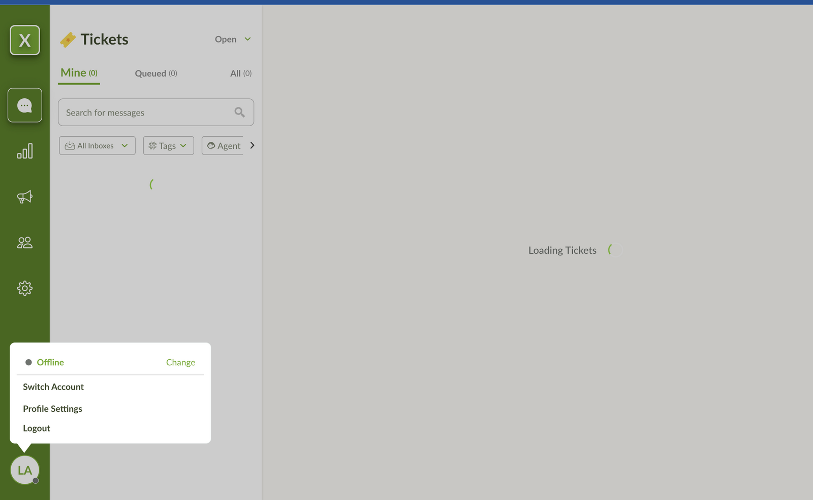
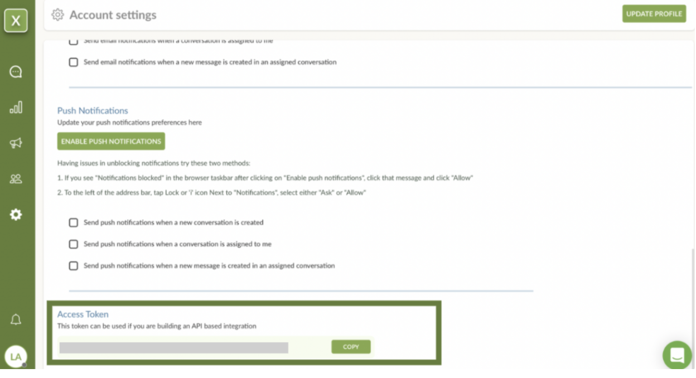

import { Card, CardGrid } from "@astrojs/starlight/components";
import CallToActionBanner from "../../../components/CallToActionBanner.astro";

## Overview

Voice Agents seamlessly integrates with Limechat to provide intelligent customer support and automated messaging capabilities. Your customers can interact naturally with voice agents through Limechat's platform for instant support, order inquiries, and personalized assistance.

<CardGrid stagger>
  <Card title="Customer Support" icon="comment">
    Handle customer inquiries and support requests automatically through
    Limechat's messaging platform.
  </Card>
  <Card title="Order Management" icon="document">
    Voice agents can check order status, process requests, and handle
    order-related inquiries seamlessly.
  </Card>
  <Card title="Automated Responses" icon="star">
    Provide instant responses to common questions and route complex queries
    to human agents when needed.
  </Card>
  <Card title="Multi-channel Support" icon="puzzle">
    Connect across multiple messaging channels supported by Limechat for
    comprehensive customer engagement.
  </Card>
</CardGrid>

## Setup Guide

To enable your Voice Agent platform to connect with Limechat, you'll need to obtain two crucial pieces of information directly from your Limechat account: your Limechat Account ID and API Access Token.

### Step 0: Access Voice Agents Integration Tab

1. **Navigate to Voice Agents Dashboard**

   Log in to your Voice Agents platform and go to the integration tab.

   

### Step 1: Obtain Your Limechat Account ID

1. **Log in to your Limechat dashboard**

   Access your Limechat account through the web interface.

2. **Locate Account ID**

   Your Account ID can typically be found directly on the Limechat Dashboard.

   

### Step 2: Obtain Your Limechat API Access Token

1. **Access Profile Settings**

   While logged into your Limechat dashboard, click on your profile picture at the extreme bottom left.

   

2. **Navigate to Profile Settings**

   Select "Profile Settings" from the menu.

3. **Find Access Token**

   Scroll down to the bottom of the Profile Settings page.

4. **Copy the Access Token**

   Copy the Access Token and keep it secure - you'll need this to connect with Voice Agents.

   

### Step 3: Connect to Voice Agents Platform

1. **Complete Limechat Connection**

   Click the "Connect" button next to Limechat, then:

   - Enter your Limechat Account ID from Step 1
   - Paste the API Access Token from Step 2
   - Click "Connect" to finalize the integration

## What's Next?

Once connected, your voice agent can immediately start handling:

- **Customer inquiries** - "I need help with my order"
- **Support requests** - "How do I track my shipment?"
- **General questions** - "What are your business hours?"
- **Product information** - "Tell me more about this product"

<CallToActionBanner
  title="Ready to enhance your customer messaging experience?"
  subtitle="Connect Limechat with Voice Agents to provide instant, intelligent customer support."
  buttonText="Schedule a Demo"
  buttonColor="#039BE5"
/>
