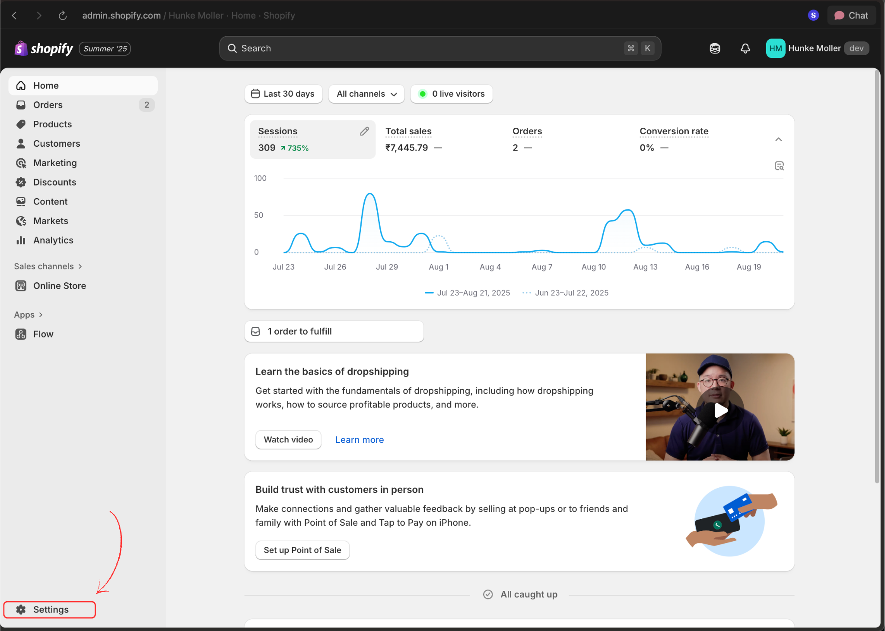
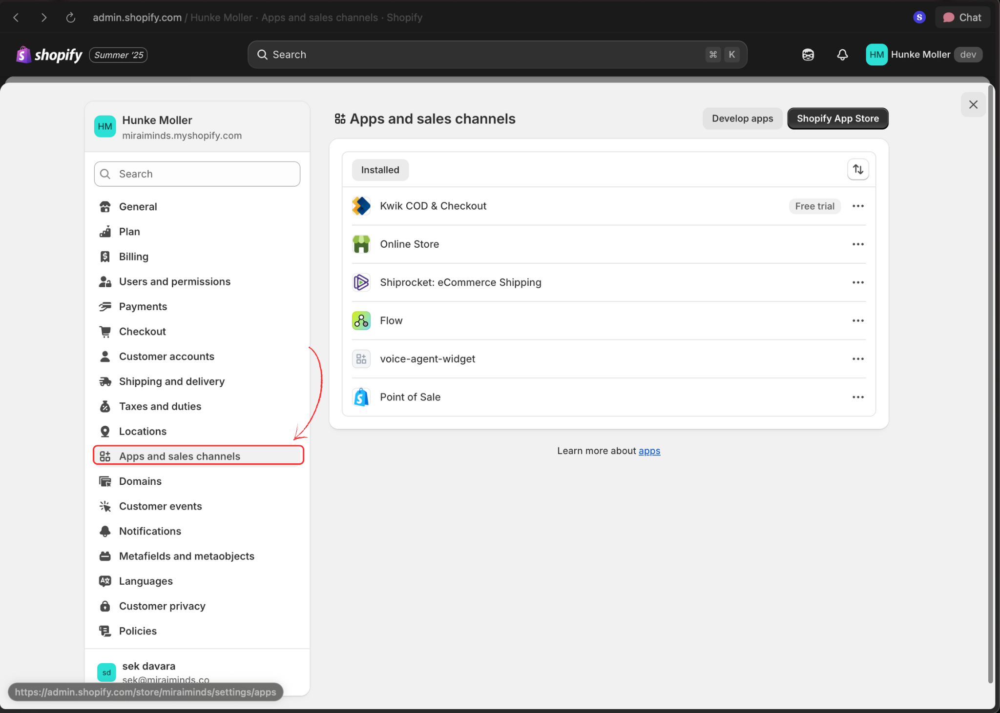
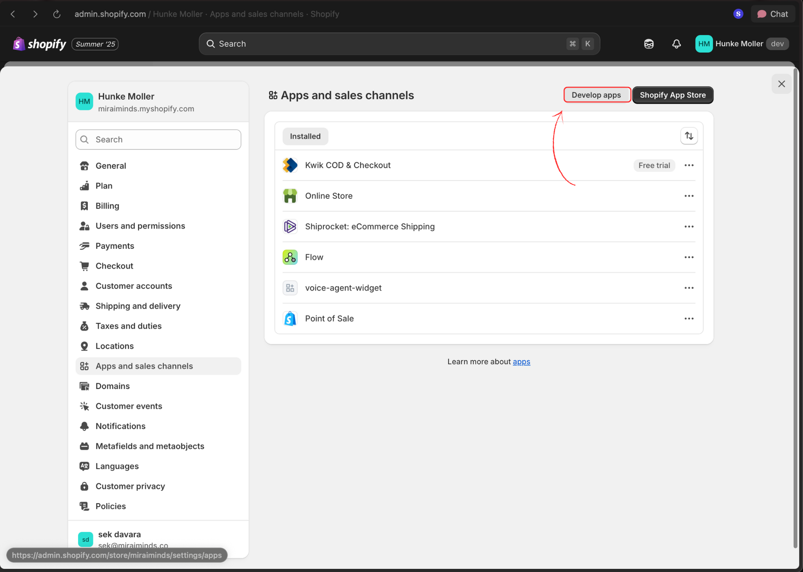
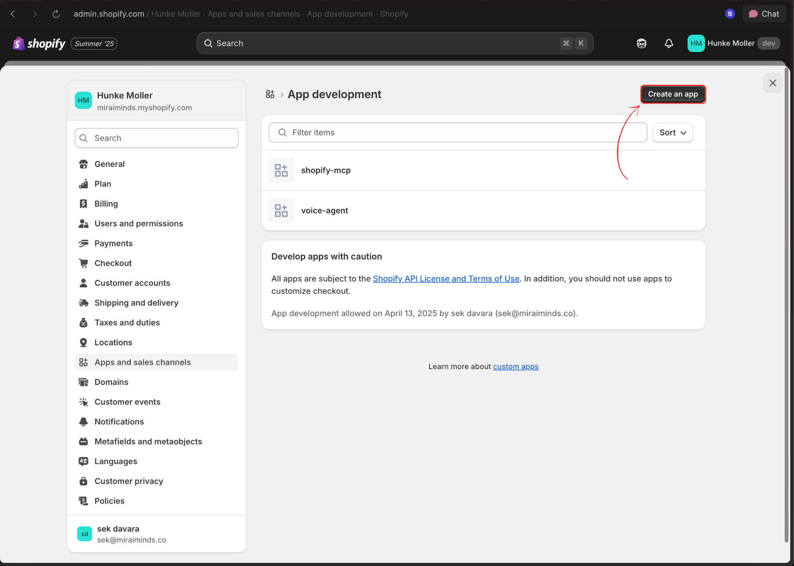
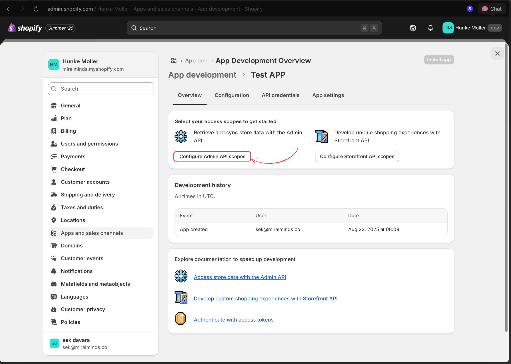
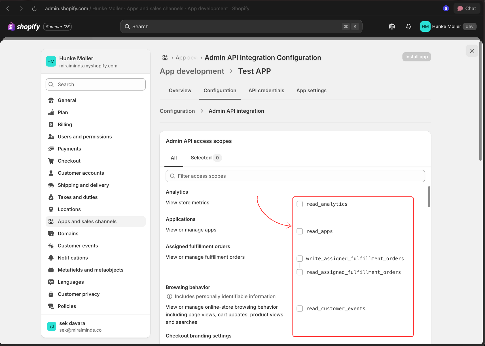
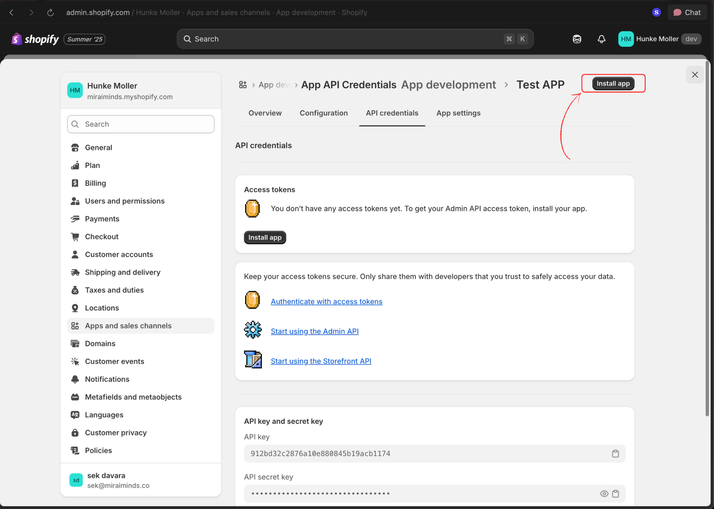
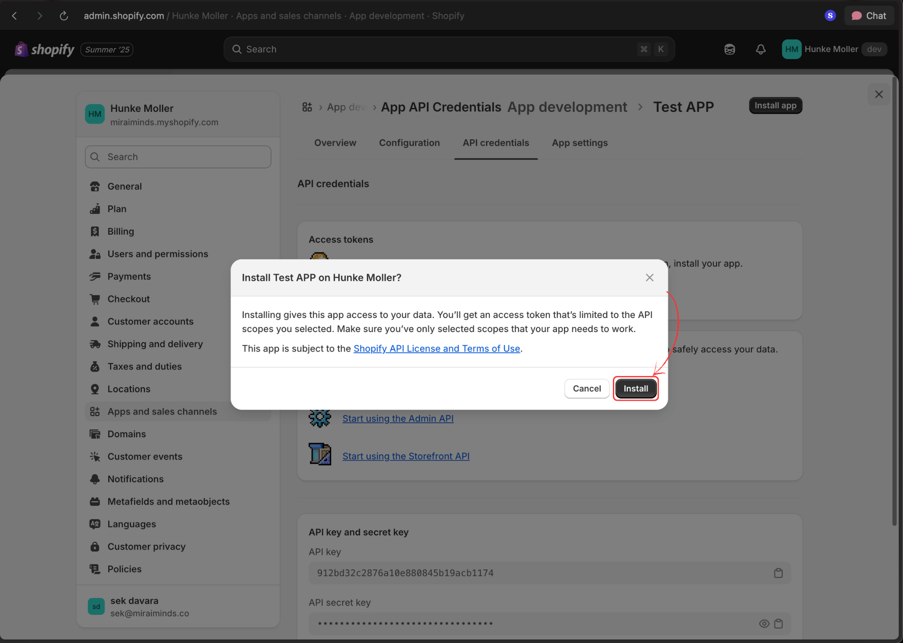
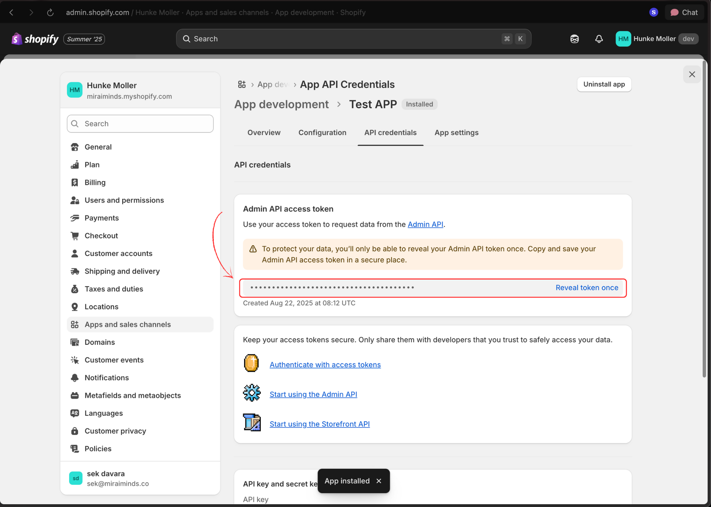

import { Card, CardGrid } from "@astrojs/starlight/components";
import CallToActionBanner from "../../../components/CallToActionBanner.astro";

## Overview

Voice Agents seamlessly integrates with Shopify to provide intelligent customer support, order tracking, inventory inquiries, and sales assistance. Your customers can interact naturally with voice agents to check order status, find products, apply discounts, and get instant support.

<CardGrid stagger>
  <Card title="Order Management" icon="document">
    Voice agents can check order status, process returns, and handle shipping
    inquiries automatically.
  </Card>
  <Card title="Product Assistance" icon="puzzle">
    Help customers find products, check inventory, and provide detailed product
    information through voice.
  </Card>
  <Card title="Customer Support" icon="comment">
    Handle common support requests like account issues, discount codes, and
    general store policies.
  </Card>
  <Card title="Sales Automation" icon="star">
    Upsell, cross-sell, and guide customers through the purchase process with
    intelligent recommendations.
  </Card>
</CardGrid>

## Required Permissions

Your voice agent needs specific Shopify API permissions to function effectively:

### Essential Scopes

- **`read_customers`** - Access customer information for personalized support
- **`read_products`** - Provide product details and inventory status
- **`read_orders`** - Check order status and history
- **`write_orders`** - Process order modifications and cancellations
- **`read_discounts`** - Apply available discount codes
- **`write_discounts`** - Create promotional codes for customers

### Optional Scopes (based on your use case)

- **`read_inventory`** - Real-time inventory checking
- **`read_shipping`** - Shipping rate calculations
- **`write_customers`** - Update customer information
- **`read_returns`** - Handle return requests

## Setup Guide

### Part 1: Create Shopify Private App

1. **Access Shopify Admin**

   Log in to your Shopify admin dashboard.

   

2. **Navigate to Settings**

   Click the "Settings" option in the bottom-left corner of your admin panel.

   

3. **Open Apps and Sales Channels**

   Select "Apps and sales channels" from the settings menu.

   

4. **Access App Development**

   Click "Develop apps" in the top navigation bar.

   

5. **Create New App**

   Click the "Create an app" button to start the setup process.

   

6. **Configure App Details**

   Enter your app name and select the app developer, then click "Create app".

   

7. **Set API Permissions**

   Click "Configure Admin API scopes" to set up the required permissions.

   

8. **Select Required Scopes**

   Enable the necessary permissions listed above. At minimum, select:

   - `read_customers`
   - `read_products`
   - `read_orders`
   - `write_orders`
   - `read_discounts`
   - `write_discounts`

   Add additional scopes based on your specific use case, then save your changes.

   

9. **Install the App**

   Click "Install app" to activate the app in your store.

   

10. **Copy Access Token**

    After installation, copy the generated access token. **Keep this secure** - you'll need it to connect with Voice Agents.

    

### Part 2: Connect to Voice Agents Platform

11. **Access Voice Agents Dashboard**

    Log in to your Voice Agents platform and navigate to the integrations page.

    

12. **Complete Shopify Connection**

    Click the "Connect" button next to Shopify, then:

    - Enter your store domain (without `https://` or `http://`)
    - Paste the access token from step 10
    - Click "Connect" to finalize the integration

    

## What's Next?

Once connected, your voice agent can immediately start handling:

- **Order inquiries** - "What's the status of my order #1234?"
- **Product questions** - "Do you have this item in stock?"
- **Customer support** - "How do I return an item?"
- **Sales assistance** - "What's your best-selling product?"

<CallToActionBanner
  title="Ready to transform your retail customer experience?"
  subtitle="Many retailers are already seeing the benefits of AI-powered Voice Agents."
  buttonText="Schedule a Demo"
  buttonColor="#039BE5"
/>
