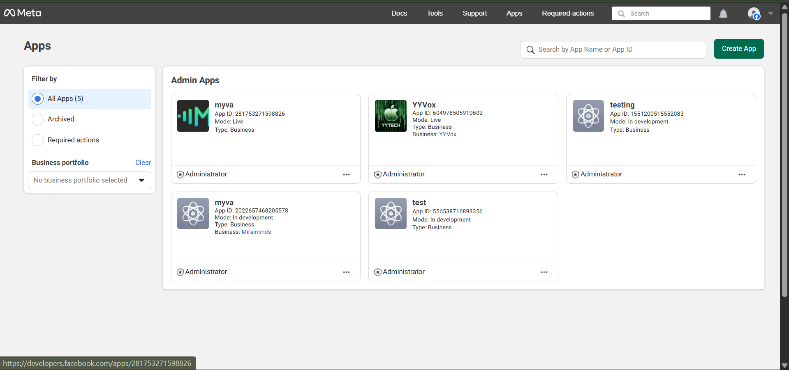
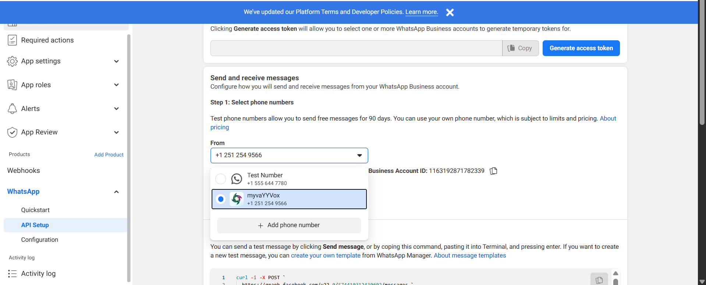
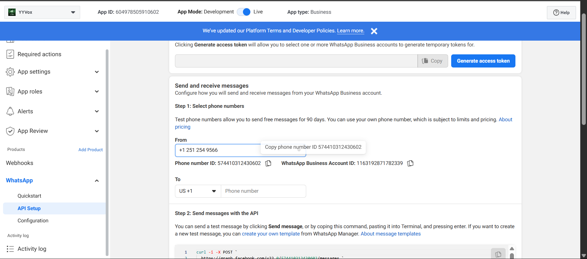
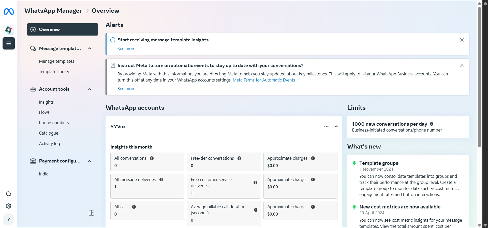
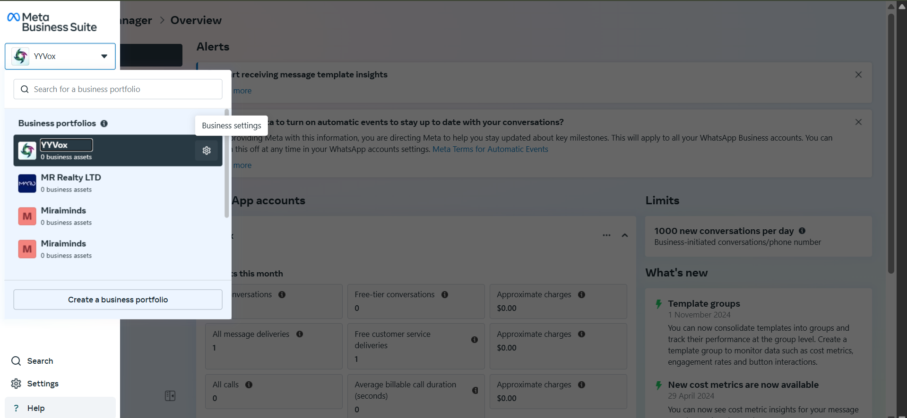
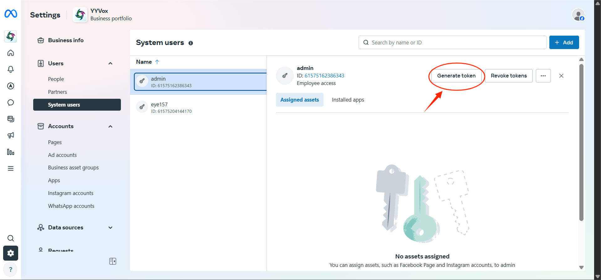
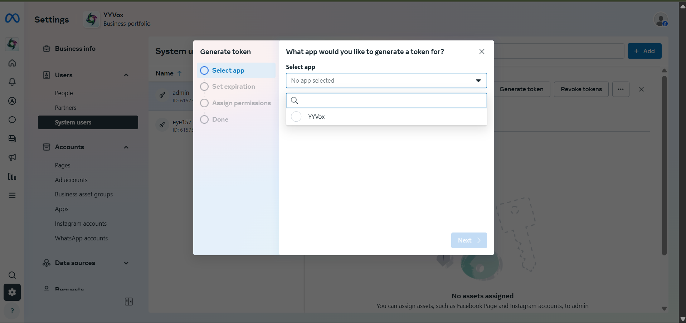
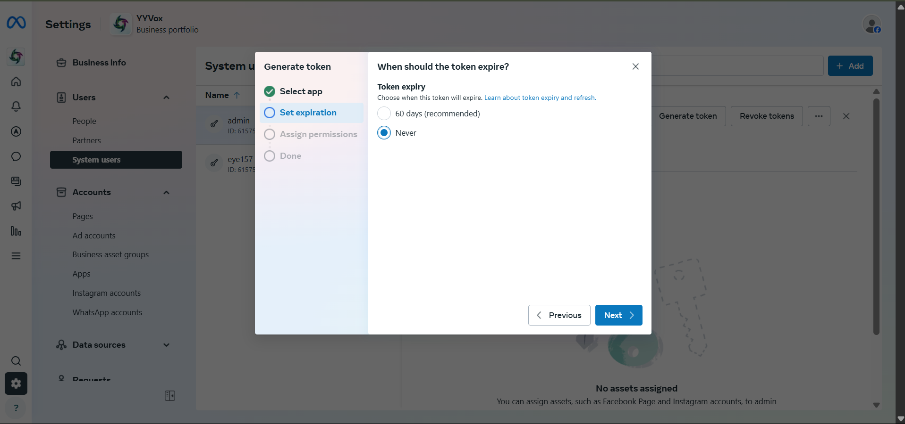
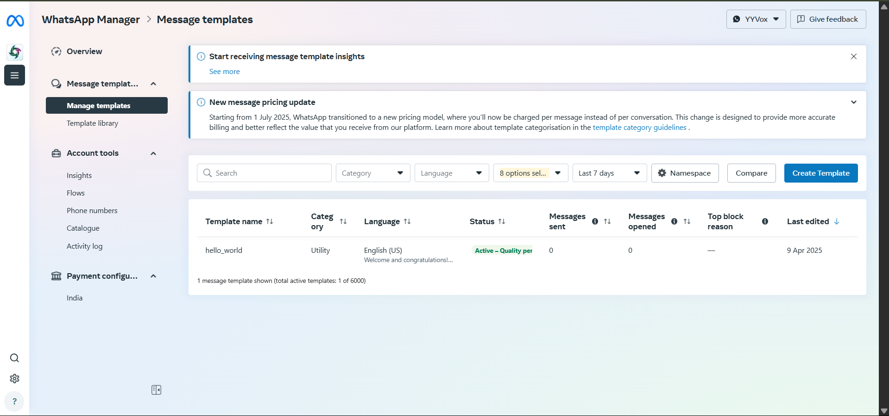

## Step-by-Step: Setting Up Your WhatsApp App

### 1. Create a New App

1. Go to **Meta for Developers**.

2. Click the green **Create App** button (top-right).

3. Select the **App Type** (Business, Consumer, Gaming, etc.).

4. Fill in basic details:

   - App Name
   - Contact Email
   - Business Manager (if required)

5. Submit, and your app will be created.

---

### 2. Use an Existing App

If you already have apps (e.g., _myva_, _YYVox_, _testing_, _test_):

1. From the **Admin Apps** section on the dashboard, select your app card.

2. This opens your app settings for further configuration.

---

### 3. Configure WhatsApp in Your App

1. In the left menu, go to **WhatsApp → API Setup**.

2. Under **Send and receive messages**, go to **Step 1: Select phone numbers**.

3. In the **From** dropdown, you will see available numbers:

   - **Test Number** (ignore this).
   - **Your Verified WhatsApp Business Number**

4. To add a new number, click **➕ Add Phone Number**.

---

### 4. Copy WhatsApp Business IDs

1. Select your verified WhatsApp Business number in the **From** dropdown.

2. Below the number, note down the:

   - **Phone Number ID** ✅ (copy from step 1).
   - **WhatsApp Business Account ID** ✅ (copy from the right side of the phone number ID).
   - **App ID** ✅ (copy from top left).

---

### 5. Generate Access Token

1. Go to **Meta Business WhatsApp Manager**.

2. In the **top-left dropdown**, select your **Business Portfolio**.

3. Open **Business Settings**.

4. Go to **System Users**.

5. Select a user with **Admin/Full Access**.

6. Generate a token:

   - Select the App you added the phone number to.

- Choose **Never Expire** (for a permanent token).

- Assign permissions:
  - `whatsapp_business_messaging`
  - `whatsapp_business_management`

👉 Save the **Access Token** securely. You’ll use it to send messages.

---

### 6. Manage & Create Templates

1. Go to **WhatsApp Manager → Manage Templates**.

2. Click **Create Template**.

3. Fill in:

   - **Template Name** (e.g., order_update)
   - **Category** (Marketing, Utility, or Authentication)
   - **Language** (e.g., en_US)
   - **Message Content** (with variables, if needed)

4. Submit for approval.

5. Once approved ✅, you can use this template in API calls.

