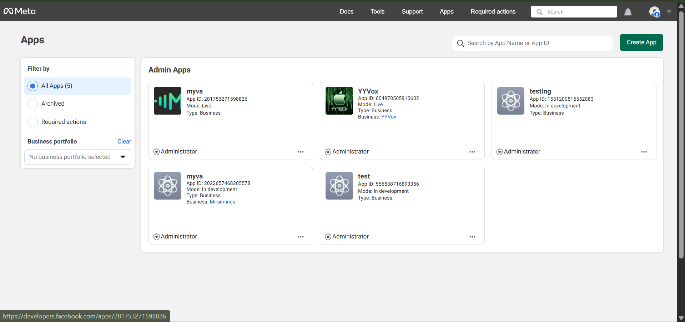
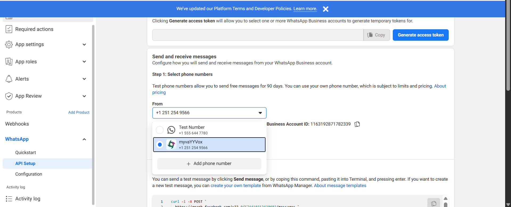
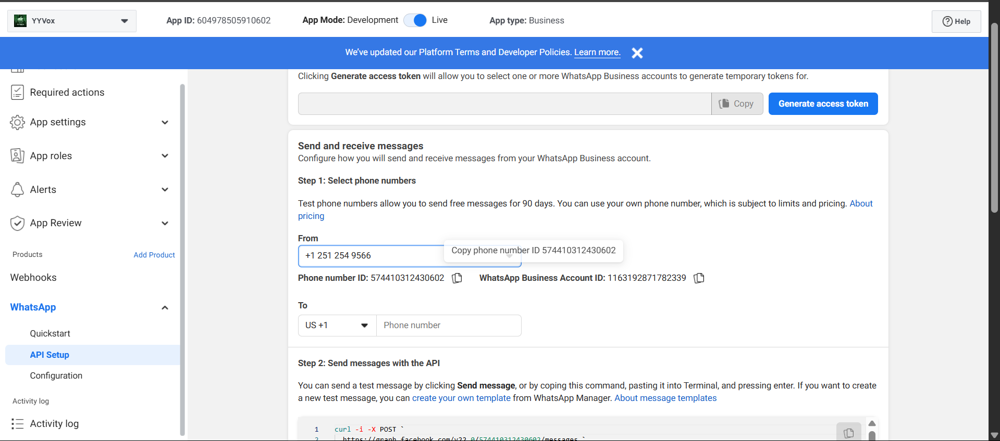
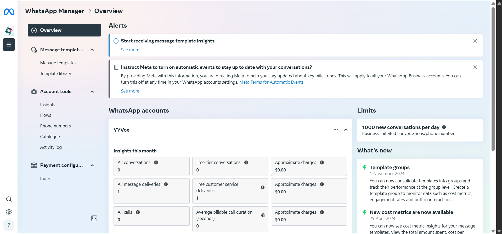
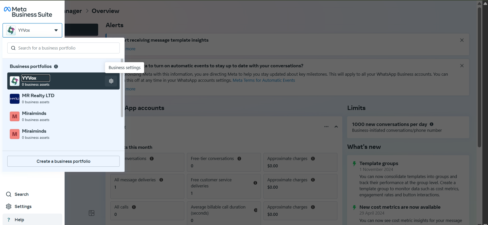
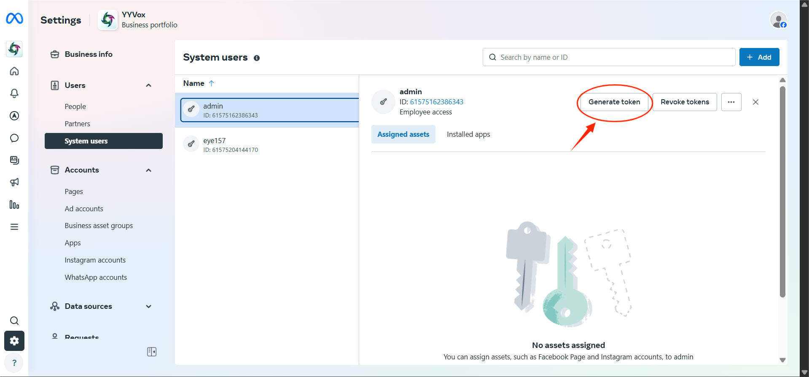
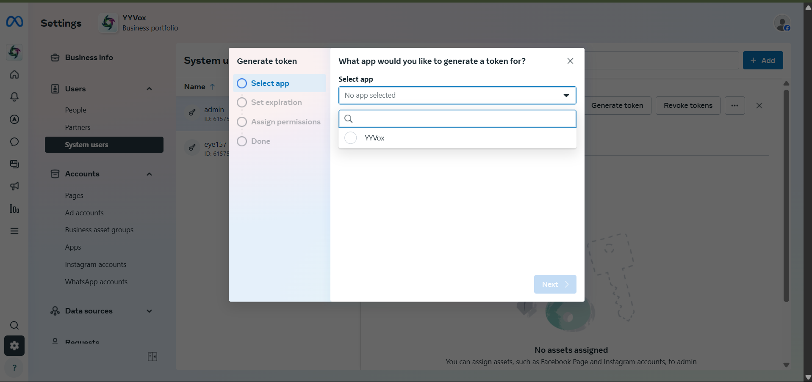
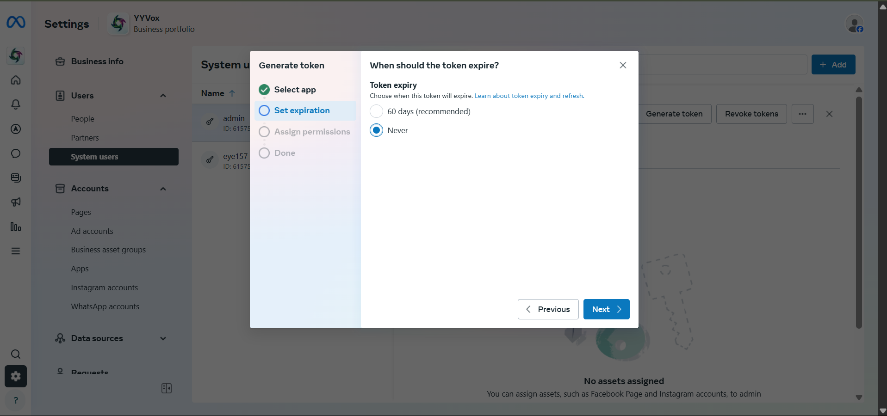
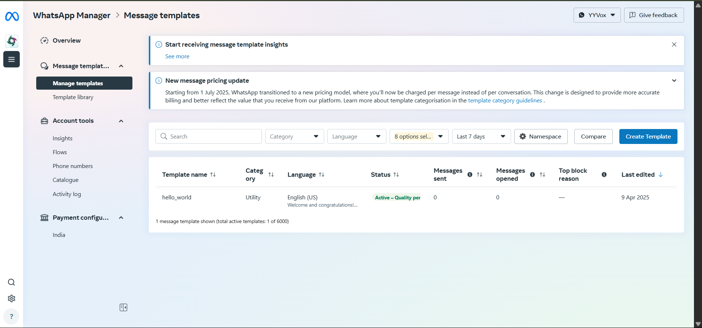

import { Card, CardGrid } from '@astrojs/starlight/components';
import CallToActionBanner from '../../../components/CallToActionBanner.astro';

## Overview

Voice Agents integrates with WhatsApp Business API to provide a unified communication experience. Customers can seamlessly switch between voice calls and WhatsApp messaging, with conversation context maintained across both channels. This creates a more flexible and accessible customer service experience.

<CardGrid stagger>
	<Card title="Unified Communications" icon="comment">
		Seamlessly transition conversations between voice and WhatsApp messaging while maintaining full context.
	</Card>
	<Card title="Rich Media Support" icon="document">
		Send images, documents, location data, and interactive buttons through WhatsApp integration.
	</Card>
	<Card title="24/7 Availability" icon="rocket">
		Provide instant responses via WhatsApp even when voice agents are busy with other customers.
	</Card>
	<Card title="Global Reach" icon="up-caret">
		Connect with customers worldwide using their preferred messaging platform.
	</Card>
</CardGrid>

## Prerequisites

Before setting up WhatsApp integration, ensure you have:

- **WhatsApp Business Account** - Verified business account on WhatsApp
- **Meta Business Manager** - Access to Meta Business Manager with admin permissions
- **Phone Number** - Verified business phone number (cannot be used on regular WhatsApp)
- **Voice Agents Account** - Active Voice Agents platform subscription

## Required Information

You'll need to collect these details during setup:

- **App ID** - Your Meta app identifier
- **Phone Number ID** - WhatsApp Business phone number identifier  
- **WhatsApp Business Account ID** - Business account identifier
- **Access Token** - Permanent access token with messaging permissions
- **Webhook Verify Token** - Custom token for webhook verification

## Setup Guide

### Step 1: Create or Select Meta App

**Option A: Create New App**

1. Visit [Meta for Developers](https://developers.facebook.com/)
2. Click **"Create App"** in the top-right corner
3. Select **"Business"** as your app type
4. Provide required details:
   - App name (e.g., "Your Company Voice Agent")
   - Contact email address
   - Business Manager account (if applicable)
5. Click **"Create App"** to proceed

**Option B: Use Existing App**

If you already have a Meta app:

1. Access your Meta for Developers dashboard
2. Select your existing app from the **"My Apps"** section
3. Ensure the app has appropriate permissions for WhatsApp Business

### Step 2: Configure WhatsApp Business API

1. **Add WhatsApp Product**
   - In your app dashboard, navigate to **"WhatsApp" → "API Setup"**
   - If WhatsApp isn't added, click **"Add to App"** next to WhatsApp

2. **Configure Phone Number**
   - Under **"Send and receive messages"**, go to **"Step 1: Select phone numbers"**
   - In the **"From"** dropdown, you'll see:
     - Test numbers (for development only)
     - Your verified WhatsApp Business numbers
   - To add a new number, click **"➕ Add Phone Number"**

### Step 3: Collect Required IDs

Once your phone number is configured:

1. **Select your verified WhatsApp Business number** from the dropdown
2. **Record these important values:**
   - **Phone Number ID** - Found below the selected number
   - **WhatsApp Business Account ID** - Located to the right of the Phone Number ID
   - **App ID** - Displayed in the top-left corner of the dashboard

:::caution[Important]
Keep these IDs secure and accessible - you'll need them to complete the Voice Agents integration.
:::

### Step 4: Generate Permanent Access Token

1. **Open WhatsApp Business Manager**
   
   Navigate to [Meta Business Manager](https://business.facebook.com/) and access WhatsApp Manager.

   

2. **Select Business Portfolio**
   
   Choose your business portfolio from the top-left dropdown menu.

3. **Access Business Settings**
   
   Click **"Business Settings"** to manage your business configuration.

   

4. **Navigate to System Users**
   
   In the left sidebar, select **"System Users"** under the Users section.

5. **Select Admin User**
   
   Choose a system user with **Admin** or **Full Access** permissions.

   

6. **Generate Access Token**
   
   Click **"Generate New Token"** and configure:
   - **App Selection**: Choose the app you configured in previous steps
   
   
   
   - **Token Expiration**: Select **"Never"** for a permanent token
   
   
   
   - **Required Permissions**:
     - `whatsapp_business_messaging` - Send and receive messages
     - `whatsapp_business_management` - Manage business settings

7. **Secure Your Token**
   
   Copy and securely store the generated access token. This token provides full access to your WhatsApp Business messaging capabilities.

:::danger[Security Warning]
Never share your access token publicly or commit it to version control. Treat it like a password.
:::

### Step 5: Create Message Templates

WhatsApp requires pre-approved templates for business-initiated conversations:

1. **Access Template Manager**
   
   Go to **WhatsApp Manager → Message Templates**.

2. **Create New Template**
   
   Click **"Create Template"** and provide:
   - **Template Name**: Descriptive name (e.g., `order_confirmation`)
   - **Category**: 
     - **Marketing** - Promotional content
     - **Utility** - Account updates, order status
     - **Authentication** - Verification codes, security alerts
   - **Language**: Your target language (e.g., `en_US`)
   - **Message Content**: Include dynamic variables using `{{1}}`, `{{2}}` syntax

3. **Submit for Review**
   
   Templates typically get reviewed within 24 hours. Only approved templates can be used for business-initiated messages.

4. **Template Best Practices**
   - Keep messages concise and relevant
   - Use clear variable placeholders
   - Follow WhatsApp's messaging policies
   - Create templates for common use cases (order updates, appointment reminders, support responses)

### Step 6: Connect to Voice Agents

1. **Access Voice Agents Dashboard**
   
   Log in to your Voice Agents platform and navigate to **Integrations**.

2. **Configure WhatsApp Integration**
   
   Click **"Connect"** next to WhatsApp and provide:
   - **App ID** (from Step 3)
   - **Phone Number ID** (from Step 3) 
   - **WhatsApp Business Account ID** (from Step 3)
   - **Access Token** (from Step 4)
   - **Webhook Verify Token** (create a custom secure string)

3. **Test Connection**
   
   Send a test message to verify the integration is working correctly.

## Use Cases & Capabilities

Once integrated, your Voice Agents can:

### Customer Support
- **Seamless handoffs** between voice and WhatsApp
- **Rich media sharing** like product images, receipts, and documents  
- **Quick replies** with predefined response options
- **Interactive buttons** for common actions

### Business Communications
- **Order confirmations** with tracking links
- **Appointment reminders** with rescheduling options
- **Support ticket updates** with status changes
- **Marketing messages** (with proper opt-in consent)

### Advanced Features
- **Location sharing** for store locations or delivery tracking
- **Multi-language support** with localized templates
- **Analytics integration** for message performance tracking
- **CRM synchronization** for unified customer profiles

## Best Practices

### Compliance & Privacy
- Always obtain proper consent before messaging customers
- Respect opt-out requests immediately
- Follow WhatsApp Business Policy guidelines
- Implement proper data retention policies

### Message Optimization  
- Use approved templates for business-initiated messages
- Keep response times under 24 hours during business conversations
- Provide clear next steps in every interaction
- Use rich media strategically to enhance communication

### Integration Management
- Monitor webhook delivery and response times
- Implement proper error handling and retry logic
- Set up alerts for API rate limit warnings
- Regularly review and update message templates

<CallToActionBanner 
  title="Ready to Integrate WhatsApp with Voice Agents?" 
  subtitle="Connect your WhatsApp Business account and start providing seamless omnichannel customer experiences today."
/>
