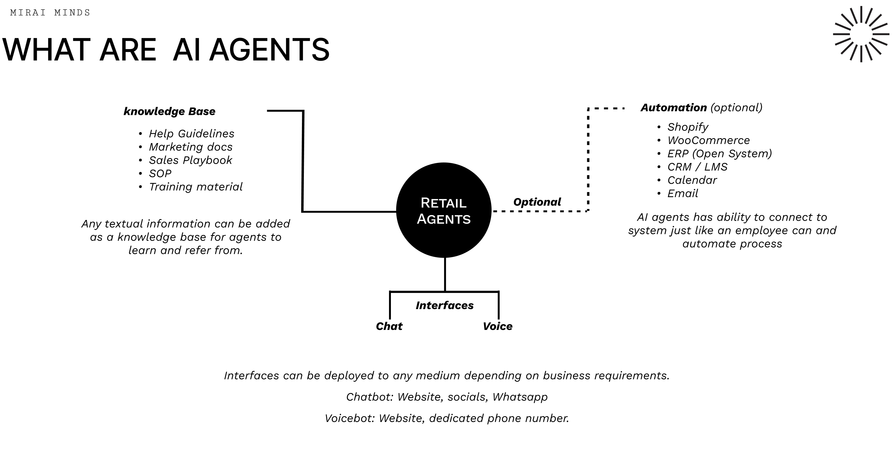
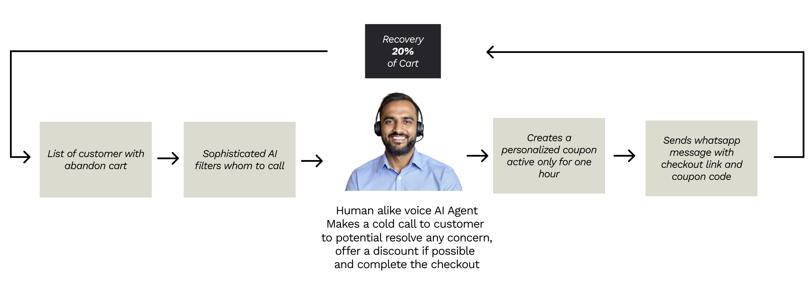

import RetailUseCases from '../../../components/RetailUseCases.astro';
import CallToActionBanner from '../../../components/CallToActionBanner.astro';

## Overview

Voice Agents revolutionize retail operations by providing intelligent, automated customer service and sales support through AI-powered conversational interfaces. These agents are specifically designed to handle the unique challenges and opportunities in the retail industry.

### How Retail AI Agents Work

Retail AI agents combine a practical knowledge base, automated integrations, and flexible ways to talk to customers — all designed to make running your store easier and more efficient.

**Knowledge base (what the agent knows)**
- **Customer service playbook**: Clear steps and friendly scripts for handling common questions and issues
- **Marketing content**: Up‑to‑date product details, promotions, and brand messaging
- **Sales playbook**: Conversation tips and tactics that help turn interest into purchases
- **Standard operating procedures**: Consistent workflows for orders, returns, and fulfillment
- **Training resources**: Guides and examples that keep the agent improving over time

**Automation and system connections**
- **Shopify**: Sync orders, check stock, and access customer profiles directly from your store
- **WooCommerce**: Same seamless flow for WordPress shops
- **ERP systems**: Tie into back‑office systems for pricing, inventory, and fulfillment data
- **CRM / LMS**: Use customer histories and training records to personalize responses and improve accuracy
- **Calendar**: Book appointments and show availability in real time
- **Email**: Send confirmations, follow‑ups, and promotional messages automatically

**How customers interact**
- **Chat**: Website widgets, social DMs, and WhatsApp for quick text conversations
- **Voice**: Phone or VoIP interactions for hands‑free support and a more human touch

### Why this matters for retail

- Provide friendly, 24/7 support so customers get answers anytime
- Scale support and sales without adding staff — handle many conversations at once
- Keep messaging consistent across channels for a reliable brand experience
- Automate routine tasks like order processing to reduce manual work and mistakes
- Offer personalized product suggestions based on customer data
- Monitor stock in real time and automate reorder alerts to prevent stockouts

You can deploy these agents wherever your customers are — on your website, social platforms, or over the phone — so they fit your business and your customers’ preferences.

## Use Cases

<RetailUseCases />

## Abandon Cart Recovery - A Detailed Use Case

One of the most impactful applications of Voice Agents in retail is automated abandon cart recovery. This sophisticated system can recover up to 20% of abandoned carts through intelligent, personalized outreach.

### How It Works

The abandon cart recovery system operates through a seamless, multi-step process:

1. **Smart Customer Identification** - The system automatically identifies customers who have abandoned their shopping carts and uses sophisticated AI filters to determine the best candidates for outreach calls.

2. **Human-like Voice Engagement** - A natural-sounding AI agent makes personalized phone calls to customers, addressing them by name and referencing their specific abandoned items.

3. **Intelligent Conversation Flow** - The agent engages in natural conversation to:
   - Understand why the customer didn't complete their purchase
   - Address any concerns or objections they might have
   - Offer personalized solutions or incentives when appropriate

4. **Dynamic Incentive Creation** - Based on the conversation, the system can generate personalized discount coupons that are active for a limited time (typically one hour) to create urgency.

5. **Multi-channel Follow-up** - After the call, the system automatically sends a WhatsApp message with a direct checkout link and the personalized coupon code, making it easy for customers to complete their purchase.

**Key Benefits:**
- **20% average cart recovery rate** - Significantly higher than traditional email-based recovery
- **Personalized approach** - Each interaction is tailored to the specific customer and their abandoned items
- **Immediate response** - Customers receive help within hours of abandoning their cart
- **Cost-effective** - Automated system scales without increasing staff costs
- **Data-driven insights** - Learn why customers abandon carts and improve your checkout process

This approach transforms a common e-commerce challenge into a revenue opportunity while providing genuine value to customers who may have encountered obstacles during their shopping journey.

### Getting Started with Retail AI Agents

Bringing Voice Agents into your retail business is easier than you might think. Below is a simple, practical path to get started and some tips to make them work well for your customers.

**Quick setup (4 easy steps)**
1. **Gather your content** — Upload product catalogs, FAQs, return policies, and any service guides the agent should know.
2. **Connect your systems** — Link Shopify, inventory, CRM, or any other tools so the agent can access orders, stock, and customer info.
3. **Choose channels** — Pick where customers will talk to the agent (website chat, social DMs, WhatsApp, phone). Start with one or two and expand later.
4. **Train and test** — Run common scenarios, fine‑tune replies, and have staff test handoffs to humans.

**Practical tips**
- Start by automating the highest-volume, repetitive requests (order status, returns, store hours).
- Make handoffs to human agents smooth and obvious for complex issues.
- Keep product details and pricing up to date so answers stay accurate.
- Track customer satisfaction and common failure points to prioritize improvements.
- Roll out new features gradually based on real customer feedback.

**What to expect (ROI)**
Most retailers see noticeable improvements within weeks: faster response times, fewer routine tickets, and happier customers. Over time, that translates into better conversion rates and lower support costs while your team focuses on higher‑value work.

<CallToActionBanner
  title="Ready to transform your retail customer experience?"
  subtitle="Many retailers are already seeing the benefits of AI-powered Voice Agents."
  buttonText="Schedule a Demo"
  buttonColor="#039BE5"
/>

